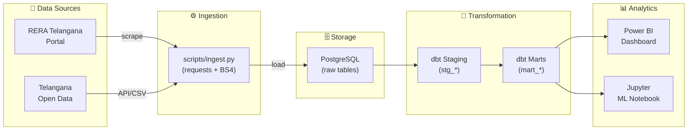

<p align="center">
  <h1 align="center">🏗️ HydRERA Analytics</h1>
  <p align="center">
    <strong>Data-driven insights into Hyderabad's real estate market using RERA &amp; Open Government Data</strong>
  </p>
  <p align="center">
    
    
    
    
    
  </p>
</p>

---

## 📖 About

**HydRERA Analytics** is an end-to-end data analytics platform that transforms raw regulatory filings from [RERA Telangana](https://rera.telangana.gov.in/) and property registration records from [Telangana Open Data](https://data.telangana.gov.in/) into actionable intelligence for homebuyers, investors, and policy analysts operating in the Hyderabad real estate market.

The platform ingests project registrations, builder histories, complaint records, and property transaction data, then applies a modern **ELT pipeline** (Python → PostgreSQL → dbt) to produce four analytical modules: a **Builder Reliability Scorecard** that ranks developers by delivery track record, a **Market Supply vs Demand** tracker that flags oversupplied localities, a **Price Fairness Analysis** that detects overpriced launches relative to market medians, and a **Delay Prediction Model** that uses machine learning to forecast which projects are at risk of missing their deadlines.

All transformed data feeds into an interactive **Power BI dashboard** for visual exploration and a **Jupyter notebook** for ML model training and SHAP-based explainability — making this a complete analytics stack from raw data to decision-ready insights.

---

## 🏛️ Architecture



---

## 🧩 Analytical Modules

### Module 1 — Builder Reliability Scorecard 🏆

Evaluates every registered builder's track record by computing **average project delay** (in days and months), **on-time delivery percentage**, and **complaint rates per 100 units**. Uses PostgreSQL `NTILE(4)` window functions to bucket builders into quartiles across three dimensions — delay, reliability, and complaints — then assigns a composite **risk tier** (`Low`, `Medium`, `High`, `Critical`) so homebuyers can instantly gauge developer trustworthiness.

### Module 2 — Market Supply vs Demand 📈

Aggregates approved units and observed transactions at the **locality × quarter** level to produce absorption rates, months-of-inventory estimates, and quarter-over-quarter demand growth. A rolling 4-quarter window smooths seasonality, and an **oversupply flag** fires when months of inventory exceeds 18 — giving investors an early warning of saturated micro-markets.

### Module 3 — Price Fairness Analysis 💰

Compares each project's **launch price per sqft** against the **trailing 4-quarter median transaction price** in the same locality. Computes a `premium_over_market_pct` metric and flags projects as **overpriced** when the premium exceeds 20%, helping buyers negotiate smarter and avoid inflated listings.

### Module 4 — Delay Prediction Model 🤖

Engineers **11 predictive features** spanning builder history (average delay, experience, complaint rate), market conditions (inventory months, absorption rate, oversupply), and project characteristics (approved units, planned duration, approval lag). Trains both **Logistic Regression** and **XGBoost** classifiers, evaluates them with ROC-AUC and classification reports, and produces **SHAP waterfall plots** for model explainability.

| Feature | Source |
|---|---|
| `feat_approved_units` | Project scale |
| `feat_planned_duration_days` | Project timeline |
| `feat_builder_avg_delay_days` | Builder history |
| `feat_builder_delay_rate_pct` | Builder history |
| `feat_builder_experience` | Builder history |
| `feat_complaints_per_100_units` | Complaint records |
| `feat_builder_risk_tier` | Scorecard output |
| `feat_locality_inventory_months` | Supply/Demand |
| `feat_locality_absorption_rate` | Supply/Demand |
| `feat_oversupply_flag` | Supply/Demand |
| `feat_approval_lag_days` | Registration timing |

---

## 📁 Project Structure

```
hydera-analytics/
│
├── .env.example              # Environment variable template
├── requirements.txt          # Python dependencies
├── README.md                 # This file
├── SETUP.md                  # Detailed setup guide
├── LICENSE                   # MIT License
│
├── scripts/
│   └── ingest.py             # Data ingestion & web scraping (857 lines)
│
├── sql/                      # Original SQL queries (reference)
│   ├── schema.yml
│   └── schema/
│       ├── mart_builder_scorecard.sql
│       ├── mart_supply_demand.sql
│       └── mart_delay_features.sql
│
├── dbt/
│   └── hydera_analytics/     # dbt project
│       ├── dbt_project.yml
│       ├── packages.yml
│       ├── profiles.yml.example
│       └── models/
│           ├── staging/
│           │   ├── schema.yml
│           │   ├── stg_projects.sql
│           │   ├── stg_builders.sql
│           │   ├── stg_complaints.sql
│           │   └── stg_transactions.sql
│           └── marts/
│               ├── schema.yml
│               ├── mart_builder_scorecard.sql
│               ├── mart_supply_demand.sql
│               ├── mart_price_fairness.sql
│               └── mart_delay_features.sql
│
├── notebooks/
│   └── delay_model.ipynb     # ML model training & SHAP analysis
│
├── data/
│   ├── raw/                  # Raw CSVs (gitignored)
│   ├── processed/            # Processed data
│   └── sample/               # 100-row sample data
│
├── dashboard/                # Power BI dashboard (.pbix)
│
└── docs/
    ├── architecture.md       # Pipeline architecture docs
    ├── data_dictionary.md    # Schema & column reference
    └── dashboard_setup.md    # Power BI setup guide
```

---

## 🚀 Quick Start

```bash
# 1️⃣  Clone the repository
git clone https://github.com/Harshaaalll/hydera-analytics.git
cd hydera-analytics

# 2️⃣  Create & activate virtual environment
python -m venv .venv
.venv\Scripts\activate        # Windows
# source .venv/bin/activate   # macOS/Linux

# 3️⃣  Install dependencies & configure environment
pip install -r requirements.txt
cp .env.example .env          # then edit .env with your PG credentials

# 4️⃣  Ingest sample data into PostgreSQL
python scripts/ingest.py --sample

# 5️⃣  Run dbt transformations
cd dbt/hydera_analytics
dbt deps
dbt run
dbt test
```

> **Note:** Ensure PostgreSQL is running and the database specified in `.env` exists before running the ingestion script.

---

## 🛠️ Tech Stack

| Layer | Technology | Version | Purpose |
|---|---|---|---|
| **Language** | Python | 3.11+ | Core scripting & ML |
| **Database** | PostgreSQL | 16 | Analytical warehouse |
| **Transformation** | dbt-core | 1.8.3 | SQL-based ELT |
| **Data Processing** | pandas | 2.2.2 | DataFrames & wrangling |
| **Web Scraping** | requests + BeautifulSoup4 | — | RERA portal scraping |
| **ORM** | SQLAlchemy | 2.0.30 | Database connectivity |
| **ML Framework** | scikit-learn | 1.5.0 | Logistic Regression |
| **Gradient Boosting** | XGBoost | 2.0+ | Delay classifier |
| **Explainability** | SHAP | 0.45+ | Feature importance |
| **Visualization** | matplotlib + seaborn | 3.9 / 0.13 | Charts & plots |
| **Dashboard** | Power BI Desktop | Latest | Interactive BI layer |
| **Notebooks** | Jupyter | 1.0 | ML experimentation |

---

## 📡 Data Sources

| Source | URL | Description |
|---|---|---|
| **RERA Telangana** | [rera.telangana.gov.in](https://rera.telangana.gov.in/) | Registered projects, builder details, complaints, project timelines and completion statuses |
| **Telangana Open Data** | [data.telangana.gov.in](https://data.telangana.gov.in/) | Property registration & transaction records (locality, stamp duty, sale values) |

---

## 📄 License

```
MIT License

Copyright (c) 2026 Harshaaalll

Permission is hereby granted, free of charge, to any person obtaining a copy
of this software and associated documentation files (the "Software"), to deal
in the Software without restriction, including without limitation the rights
to use, copy, modify, merge, publish, distribute, sublicense, and/or sell
copies of the Software, and to permit persons to whom the Software is
furnished to do so, subject to the following conditions:

The above copyright notice and this permission notice shall be included in all
copies or substantial portions of the Software.

THE SOFTWARE IS PROVIDED "AS IS", WITHOUT WARRANTY OF ANY KIND, EXPRESS OR
IMPLIED, INCLUDING BUT NOT LIMITED TO THE WARRANTIES OF MERCHANTABILITY,
FITNESS FOR A PARTICULAR PURPOSE AND NONINFRINGEMENT. IN NO EVENT SHALL THE
AUTHORS OR COPYRIGHT HOLDERS BE LIABLE FOR ANY CLAIM, DAMAGES OR OTHER
LIABILITY, WHETHER IN AN ACTION OF CONTRACT, TORT OR OTHERWISE, ARISING FROM,
OUT OF OR IN CONNECTION WITH THE SOFTWARE OR THE USE OR OTHER DEALINGS IN THE
SOFTWARE.
```

---

## 🤝 Contributing

Contributions are welcome! If you'd like to improve HydRERA Analytics:

1. **Fork** the repository
2. **Create** a feature branch (`git checkout -b feature/amazing-feature`)
3. **Commit** your changes (`git commit -m 'Add amazing feature'`)
4. **Push** to the branch (`git push origin feature/amazing-feature`)
5. **Open** a Pull Request

Please ensure your code follows the existing project structure and includes appropriate documentation updates.

---

<p align="center">
  Built with ❤️ for Hyderabad's homebuyers
</p>