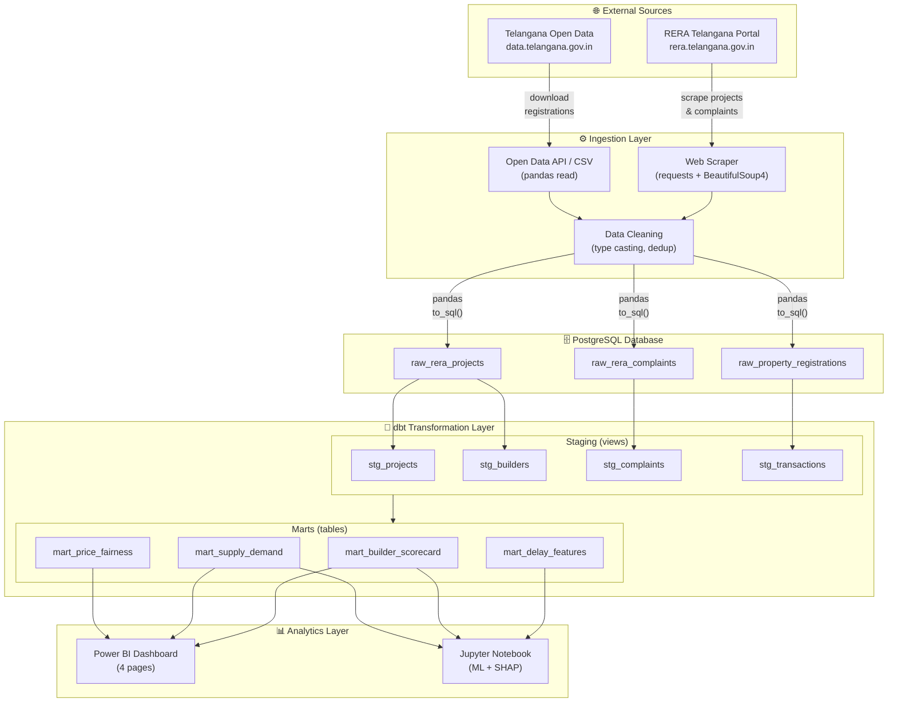
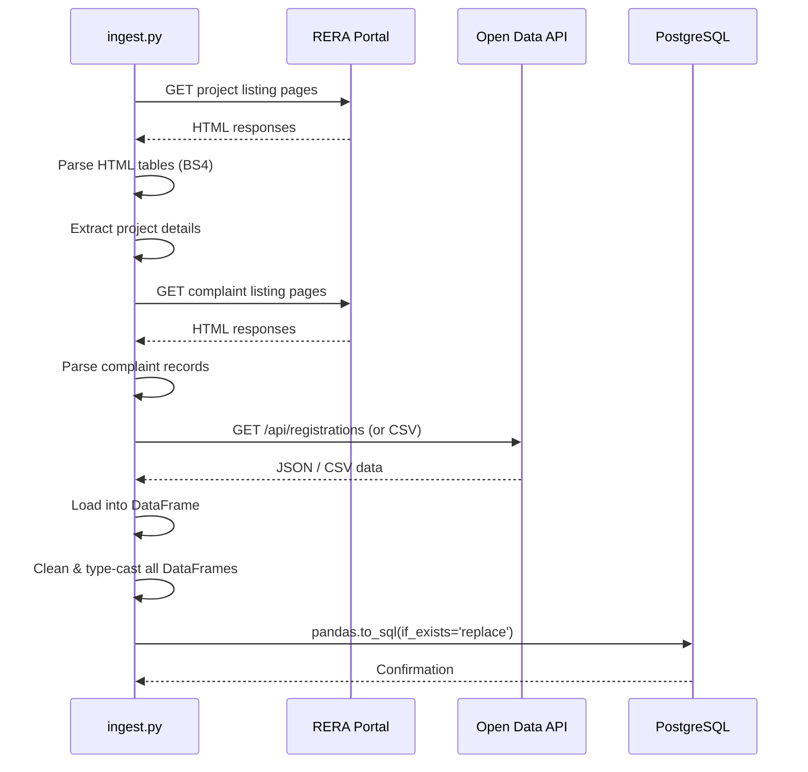
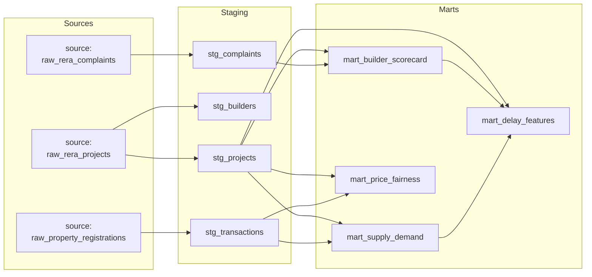
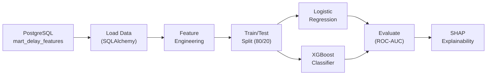
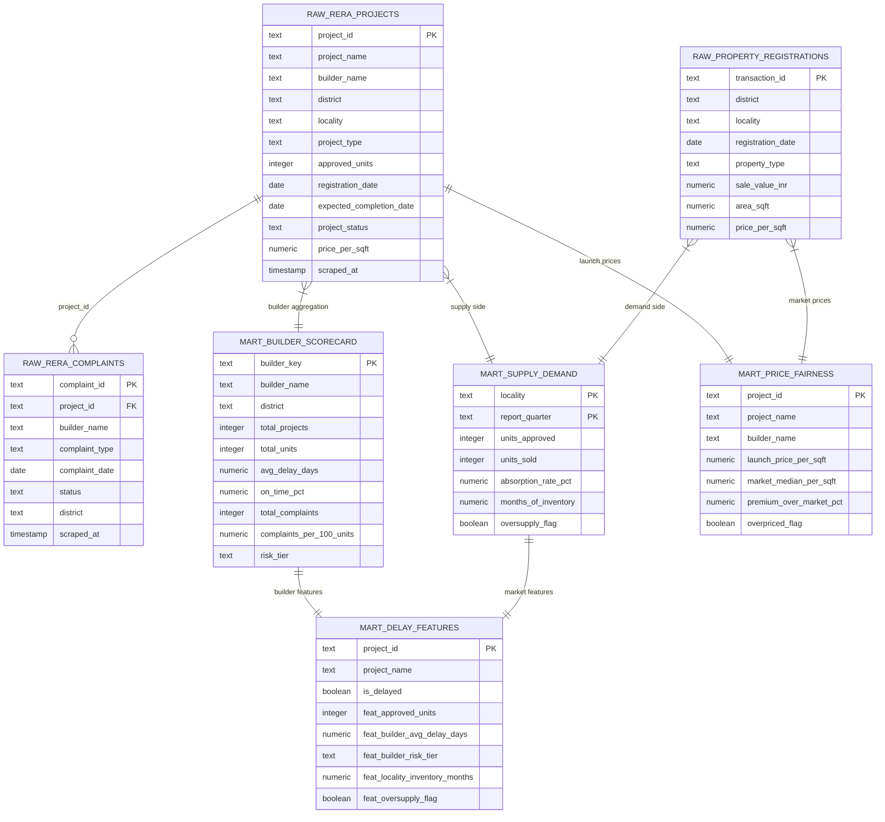

# 🏛️ Architecture — HydRERA Analytics

> Technical architecture documentation for the HydRERA Analytics data pipeline, covering ingestion, transformation, and analytics layers.

---

## Table of Contents

- [Overview](#overview)
- [Data Flow Diagram](#data-flow-diagram)
- [Ingestion Layer](#ingestion-layer)
- [Transformation Layer](#transformation-layer)
- [Analytics Layer](#analytics-layer)
- [Database Schema](#database-schema)

---

## Overview

HydRERA Analytics follows a modern **ELT (Extract, Load, Transform)** architecture. Raw data is extracted from external government sources via web scraping and API calls, loaded into PostgreSQL as-is, and then transformed in-place using dbt (data build tool) to produce analytics-ready mart tables. The final outputs are consumed by Power BI for interactive dashboards and Jupyter notebooks for machine learning.

**Design Principles:**
- **Separation of concerns** — ingestion, transformation, and presentation are decoupled
- **Idempotent loads** — re-running `ingest.py` replaces raw tables cleanly
- **Incremental complexity** — staging models clean data, marts add business logic
- **Reproducibility** — dbt manages lineage, tests, and documentation

---

## Data Flow Diagram



---

## Ingestion Layer

**Script:** `scripts/ingest.py`

The ingestion script handles all data extraction, cleaning, and loading into PostgreSQL.

### Data Sources

| # | Source | Method | Raw Table | Records (approx.) |
|---|--------|--------|-----------|-------------------|
| 1 | RERA Telangana — Projects | Web scraping (requests + BS4) | `raw_rera_projects` | ~5,000+ |
| 2 | RERA Telangana — Complaints | Web scraping (requests + BS4) | `raw_rera_complaints` | ~1,000+ |
| 3 | Telangana Open Data — Registrations | API / CSV download (pandas) | `raw_property_registrations` | ~50,000+ |

### Scraping Approach



### Cleaning Logic

The ingestion script applies the following cleaning operations before loading:

| Operation | Details |
|-----------|---------|
| **String trimming** | Leading/trailing whitespace removed from all text columns |
| **Date parsing** | Multiple date formats handled (`DD-MM-YYYY`, `YYYY-MM-DD`, `DD/MM/YYYY`) |
| **Type casting** | Numeric columns cast from strings, handling commas and INR symbols |
| **Deduplication** | Duplicate rows removed based on primary key columns |
| **Null handling** | Empty strings converted to `NULL`, sentinel values replaced |
| **Price derivation** | `price_per_sqft` computed as `sale_value_inr / area_sqft` where missing |
| **Timestamp tagging** | `scraped_at` column added with current UTC timestamp |

### PostgreSQL Loading

- Uses `pandas.DataFrame.to_sql()` with `if_exists='replace'` for full refresh
- SQLAlchemy engine constructed from `.env` credentials via `python-dotenv`
- Connection string: `postgresql://{PG_USER}:{PG_PASSWORD}@{PG_HOST}:{PG_PORT}/{PG_DB}`
- `--sample` flag loads a smaller representative dataset for development

---

## Transformation Layer

**Tool:** dbt-core 1.8.3 + dbt-postgres 1.8.2

### Directory Structure

```
dbt_project/
├── dbt_project.yml
├── profiles.yml
├── models/
│   ├── staging/
│   │   ├── _staging.yml          # Source definitions & docs
│   │   ├── stg_projects.sql
│   │   ├── stg_builders.sql
│   │   ├── stg_complaints.sql
│   │   └── stg_transactions.sql
│   └── marts/
│       ├── _marts.yml            # Mart documentation
│       ├── mart_builder_scorecard.sql
│       ├── mart_supply_demand.sql
│       ├── mart_price_fairness.sql
│       └── mart_delay_features.sql
└── tests/
```

### Staging Models (Views)

Staging models serve as the **cleaning and standardization** layer. They are materialized as **views** to avoid duplicating raw data.

| Model | Source | Key Transformations |
|-------|--------|-------------------|
| `stg_projects` | `raw_rera_projects` | Trim names, compute `builder_key` slug, calculate `planned_duration_days` and `delay_days` |
| `stg_builders` | `raw_rera_projects` | `GROUP BY builder_key` to create a distinct builder dimension with project/unit counts |
| `stg_complaints` | `raw_rera_complaints` | Trim and standardize fields, derive `builder_key` for joins |
| `stg_transactions` | `raw_property_registrations` | Standardize locality names, derive `registration_quarter` |

### Mart Models (Tables)

Mart models encode **business logic** and are materialized as **tables** for query performance.

| Model | Key Logic |
|-------|-----------|
| `mart_builder_scorecard` | Joins projects + complaints, computes per-builder delay/complaint metrics, applies `NTILE(4)` quartile bucketing, derives composite `risk_tier` |
| `mart_supply_demand` | Aggregates supply (approved units) and demand (transactions) by locality × quarter, computes rolling 4Q windows, absorption rate, months of inventory, oversupply flag |
| `mart_price_fairness` | Computes trailing 4Q median price per sqft by locality using `PERCENTILE_CONT(0.5)`, compares against launch prices, flags overpriced projects (>20% premium) |
| `mart_delay_features` | Joins project data with builder scorecard and supply/demand metrics to create 11 ML-ready features plus the `is_delayed` target variable |

### dbt DAG



### Running dbt

```bash
cd dbt_project

# Run all models
dbt run

# Run only staging models
dbt run --select staging.*

# Run only mart models
dbt run --select marts.*

# Run tests
dbt test

# Generate documentation
dbt docs generate
dbt docs serve
```

---

## Analytics Layer

### Power BI Dashboard

The Power BI dashboard (`dashboards/hydera_analytics.pbix`) connects directly to PostgreSQL mart tables and provides 4 interactive pages:

| Page | Title | Key Visuals |
|------|-------|-------------|
| 1 | Overview | KPI cards, project map, status distribution, registration timeline |
| 2 | Builder Reliability | Risk tier table, delay bar charts, builder comparison |
| 3 | Supply vs Demand | Combo charts (supply/demand), absorption trends, inventory heatmap |
| 4 | Price Fairness & Delays | Price scatter plot, overpriced projects, delay prediction features |

See [Dashboard Setup Guide](dashboard_setup.md) for detailed configuration instructions.

### Jupyter ML Notebook

The notebook (`notebooks/delay_model.ipynb`) performs:

1. **Data Loading** — Queries `mart_delay_features` via SQLAlchemy
2. **Feature Engineering** — One-hot encodes `feat_builder_risk_tier`, scales numeric features
3. **Train/Test Split** — 80/20 stratified split on `is_delayed`
4. **Model Training** — Logistic Regression and XGBoost classifiers
5. **Evaluation** — ROC-AUC scores, confusion matrices, classification reports
6. **Explainability** — SHAP summary plots and waterfall charts for individual predictions



---

## Database Schema

### Entity Relationship Diagram



### Table Counts

| Layer | Table Count | Materialization |
|-------|-------------|-----------------|
| Raw | 3 tables | Physical tables (pandas `to_sql`) |
| Staging | 4 models | Views (dbt) |
| Marts | 4 models | Tables (dbt) |
| **Total** | **11** | — |

---

*Last updated: 2026-05-21*
