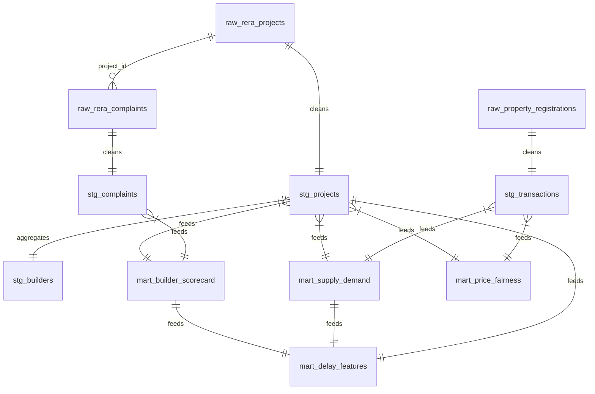

# 📘 Data Dictionary — HydRERA Analytics

> Complete schema reference for all raw tables, staging models, and mart models in the HydRERA Analytics pipeline.

---

## Table of Contents

- [Raw Tables](#raw-tables)
  - [raw\_rera\_projects](#raw_rera_projects)
  - [raw\_rera\_complaints](#raw_rera_complaints)
  - [raw\_property\_registrations](#raw_property_registrations)
- [Staging Models](#staging-models)
  - [stg\_projects](#stg_projects)
  - [stg\_builders](#stg_builders)
  - [stg\_complaints](#stg_complaints)
  - [stg\_transactions](#stg_transactions)
- [Mart Models](#mart-models)
  - [mart\_builder\_scorecard](#mart_builder_scorecard)
  - [mart\_supply\_demand](#mart_supply_demand)
  - [mart\_price\_fairness](#mart_price_fairness)
  - [mart\_delay\_features](#mart_delay_features)

---

## Raw Tables

These tables are loaded directly by `scripts/ingest.py` from external data sources into PostgreSQL. No transformations are applied at this stage.

### `raw_rera_projects`

Source: RERA Telangana portal — registered project filings.

| # | Column | Data Type | Description |
|---|--------|-----------|-------------|
| 1 | `project_id` | `text` | Unique RERA registration number (e.g., `P02400001234`) |
| 2 | `project_name` | `text` | Name of the real estate project |
| 3 | `builder_name` | `text` | Name of the promoter / builder company |
| 4 | `district` | `text` | District where the project is located (e.g., Rangareddy, Medchal-Malkajgiri) |
| 5 | `locality` | `text` | Locality / area within the district |
| 6 | `project_type` | `text` | Type of project (Residential, Commercial, Mixed) |
| 7 | `approved_units` | `integer` | Total number of units approved in the project |
| 8 | `registration_date` | `date` | Date the project was registered with RERA |
| 9 | `expected_completion_date` | `date` | Originally declared expected completion date |
| 10 | `project_status` | `text` | Current status (Ongoing, Completed, Lapsed, Revoked) |
| 11 | `price_per_sqft` | `numeric` | Declared price per square foot at launch (INR) |
| 12 | `scraped_at` | `timestamp` | Timestamp when the record was scraped |

### `raw_rera_complaints`

Source: RERA Telangana portal — complaints filed against registered projects.

| # | Column | Data Type | Description |
|---|--------|-----------|-------------|
| 1 | `complaint_id` | `text` | Unique complaint reference number |
| 2 | `project_id` | `text` | RERA project ID the complaint is filed against |
| 3 | `builder_name` | `text` | Builder / promoter name |
| 4 | `complaint_type` | `text` | Category of complaint (Delay, Quality, Refund, Others) |
| 5 | `complaint_date` | `date` | Date the complaint was filed |
| 6 | `status` | `text` | Resolution status (Pending, Resolved, Dismissed) |
| 7 | `district` | `text` | District of the associated project |
| 8 | `scraped_at` | `timestamp` | Timestamp when the record was scraped |

### `raw_property_registrations`

Source: Telangana Open Data — property registration & transaction records.

| # | Column | Data Type | Description |
|---|--------|-----------|-------------|
| 1 | `transaction_id` | `text` | Unique registration document number |
| 2 | `district` | `text` | District where the property is registered |
| 3 | `locality` | `text` | Locality / area of the property |
| 4 | `registration_date` | `date` | Date of property registration |
| 5 | `property_type` | `text` | Type of property (Flat, Plot, Villa, etc.) |
| 6 | `sale_value_inr` | `numeric` | Total sale consideration amount in INR |
| 7 | `area_sqft` | `numeric` | Area of the property in square feet |
| 8 | `price_per_sqft` | `numeric` | Derived price per sqft (`sale_value_inr / area_sqft`) |

---

## Staging Models

Staging models clean, rename, and lightly transform raw data. They are materialized as **views** in dbt to avoid data duplication.

### `stg_projects`

Source: `raw_rera_projects` — cleaned and standardized project records.

| # | Column | Data Type | Description |
|---|--------|-----------|-------------|
| 1 | `project_id` | `text` | RERA registration number (trimmed, uppercased) |
| 2 | `project_name` | `text` | Cleaned project name |
| 3 | `builder_name` | `text` | Standardized builder name (trimmed) |
| 4 | `builder_key` | `text` | Lowercase, slug-ified builder identifier for joins |
| 5 | `district` | `text` | Cleaned district name |
| 6 | `locality` | `text` | Cleaned locality name |
| 7 | `project_type` | `text` | Project type (Residential, Commercial, Mixed) |
| 8 | `approved_units` | `integer` | Number of approved units |
| 9 | `registration_date` | `date` | RERA registration date |
| 10 | `expected_completion_date` | `date` | Declared completion date |
| 11 | `project_status` | `text` | Current project status |
| 12 | `price_per_sqft` | `numeric` | Launch price per sqft (INR) |
| 13 | `planned_duration_days` | `integer` | Calculated: `expected_completion_date - registration_date` |
| 14 | `delay_days` | `integer` | Calculated: days past expected completion (0 if not delayed) |

### `stg_builders`

Source: `raw_rera_projects` — distinct builder dimension.

| # | Column | Data Type | Description |
|---|--------|-----------|-------------|
| 1 | `builder_key` | `text` | Unique lowercase slug identifier for the builder |
| 2 | `builder_name` | `text` | Canonical builder / promoter name |
| 3 | `district` | `text` | Primary district of operations |
| 4 | `total_projects` | `integer` | Count of projects registered under this builder |
| 5 | `total_units` | `integer` | Sum of approved units across all projects |

### `stg_complaints`

Source: `raw_rera_complaints` — cleaned complaint records.

| # | Column | Data Type | Description |
|---|--------|-----------|-------------|
| 1 | `complaint_id` | `text` | Unique complaint reference |
| 2 | `project_id` | `text` | Associated RERA project ID |
| 3 | `builder_name` | `text` | Builder name (standardized) |
| 4 | `builder_key` | `text` | Slug-ified builder key for joins |
| 5 | `complaint_type` | `text` | Complaint category |
| 6 | `complaint_date` | `date` | Date filed |
| 7 | `status` | `text` | Resolution status |
| 8 | `district` | `text` | District |

### `stg_transactions`

Source: `raw_property_registrations` — cleaned transaction records.

| # | Column | Data Type | Description |
|---|--------|-----------|-------------|
| 1 | `transaction_id` | `text` | Unique document number |
| 2 | `district` | `text` | District name (standardized) |
| 3 | `locality` | `text` | Locality name (standardized) |
| 4 | `registration_date` | `date` | Registration date |
| 5 | `registration_quarter` | `text` | Derived quarter string (e.g., `2024-Q2`) |
| 6 | `property_type` | `text` | Property type |
| 7 | `sale_value_inr` | `numeric` | Sale consideration (INR) |
| 8 | `area_sqft` | `numeric` | Property area in sqft |
| 9 | `price_per_sqft` | `numeric` | Computed price per sqft |

---

## Mart Models

Mart models contain the final business logic and are materialized as **tables** in dbt for performance. These models power the Power BI dashboard and Jupyter ML notebook.

### `mart_builder_scorecard`

**Purpose:** Scores every builder on delivery reliability, delay history, and complaint rates. Assigns composite risk tiers using NTILE quartile bucketing.

| # | Column | Data Type | Description |
|---|--------|-----------|-------------|
| 1 | `builder_key` | `text` | Unique builder identifier (slug) |
| 2 | `builder_name` | `text` | Canonical builder name |
| 3 | `district` | `text` | Primary operating district |
| 4 | `total_projects` | `integer` | Total registered projects |
| 5 | `total_units` | `integer` | Total approved units across all projects |
| 6 | `avg_delay_days` | `numeric` | Average delay in days across all projects |
| 7 | `avg_delay_months` | `numeric` | Average delay in months (`avg_delay_days / 30.0`) |
| 8 | `on_time_count` | `integer` | Number of projects completed on time (delay ≤ 0) |
| 9 | `on_time_pct` | `numeric` | Percentage of projects delivered on time |
| 10 | `total_complaints` | `integer` | Total complaints filed against this builder |
| 11 | `complaints_per_100_units` | `numeric` | Normalized complaint rate: `(total_complaints * 100.0) / total_units` |
| 12 | `delay_quartile` | `integer` | NTILE(4) quartile for average delay (1 = lowest delay) |
| 13 | `reliability_quartile` | `integer` | NTILE(4) quartile for on-time percentage (1 = best reliability) |
| 14 | `complaint_quartile` | `integer` | NTILE(4) quartile for complaint rate (1 = fewest complaints) |
| 15 | `risk_tier` | `text` | Composite risk tier: **Low** (avg quartile ≤ 1.5), **Medium** (≤ 2.5), **High** (≤ 3.5), **Critical** (> 3.5) |

**Business Logic:**
- `risk_tier` is derived from the average of `delay_quartile`, `reliability_quartile`, and `complaint_quartile`
- Quartiles use `NTILE(4) OVER (ORDER BY ...)` window functions
- Higher quartile numbers indicate worse performance

---

### `mart_supply_demand`

**Purpose:** Tracks real estate supply (approved units) vs demand (registered transactions) at the locality × quarter level. Identifies oversaturated markets.

| # | Column | Data Type | Description |
|---|--------|-----------|-------------|
| 1 | `locality` | `text` | Locality / micro-market name |
| 2 | `district` | `text` | District name |
| 3 | `report_quarter` | `text` | Quarter identifier (e.g., `2024-Q3`) |
| 4 | `units_approved` | `integer` | Total units approved in new projects this quarter |
| 5 | `projects_launched` | `integer` | Number of new projects registered this quarter |
| 6 | `units_sold` | `integer` | Count of property transactions registered this quarter |
| 7 | `median_price_per_sqft` | `numeric` | Median transaction price per sqft this quarter |
| 8 | `total_transaction_value_inr` | `numeric` | Sum of all transaction sale values (INR) |
| 9 | `rolling_4q_supply` | `integer` | Rolling 4-quarter sum of `units_approved` |
| 10 | `rolling_4q_demand` | `integer` | Rolling 4-quarter sum of `units_sold` |
| 11 | `prev_q_units_sold` | `integer` | Previous quarter's `units_sold` (LAG window) |
| 12 | `absorption_rate_pct` | `numeric` | `(units_sold * 100.0) / NULLIF(units_approved, 0)` |
| 13 | `months_of_inventory` | `numeric` | `(rolling_4q_supply - rolling_4q_demand) * 3.0 / NULLIF(units_sold, 0)` — months to clear remaining stock at current sales rate |
| 14 | `qoq_demand_growth_pct` | `numeric` | Quarter-over-quarter demand growth: `((units_sold - prev_q_units_sold) * 100.0) / NULLIF(prev_q_units_sold, 0)` |
| 15 | `oversupply_flag` | `boolean` | `TRUE` when `months_of_inventory > 18` |

**Business Logic:**
- Rolling windows use `SUM(...) OVER (PARTITION BY locality ORDER BY report_quarter ROWS BETWEEN 3 PRECEDING AND CURRENT ROW)`
- `oversupply_flag` threshold of 18 months aligns with RERA project lifecycle norms
- `absorption_rate_pct` > 100% means demand exceeds new supply

---

### `mart_price_fairness`

**Purpose:** Compares each project's launch price against the trailing market median to detect overpriced listings.

| # | Column | Data Type | Description |
|---|--------|-----------|-------------|
| 1 | `project_id` | `text` | RERA project registration number |
| 2 | `project_name` | `text` | Project name |
| 3 | `builder_name` | `text` | Builder / promoter name |
| 4 | `builder_key` | `text` | Slug-ified builder key |
| 5 | `locality` | `text` | Project locality |
| 6 | `district` | `text` | Project district |
| 7 | `registration_date` | `date` | RERA registration date |
| 8 | `launch_quarter` | `text` | Quarter of project registration (e.g., `2024-Q1`) |
| 9 | `approved_units` | `integer` | Number of approved units |
| 10 | `project_status` | `text` | Current project status |
| 11 | `launch_price_per_sqft` | `numeric` | Declared price per sqft at project launch |
| 12 | `market_median_per_sqft` | `numeric` | Median transaction price per sqft in the same locality over the trailing 4 quarters |
| 13 | `market_txn_count` | `integer` | Number of transactions used to compute the median (data quality indicator) |
| 14 | `premium_over_market_pct` | `numeric` | `((launch_price_per_sqft - market_median_per_sqft) * 100.0) / NULLIF(market_median_per_sqft, 0)` |
| 15 | `overpriced_flag` | `boolean` | `TRUE` when `premium_over_market_pct > 20` |

**Business Logic:**
- `market_median_per_sqft` is computed using `PERCENTILE_CONT(0.5)` over transactions in the same locality within the 4 quarters preceding the project's `launch_quarter`
- `market_txn_count` acts as a confidence score — low counts mean the median is less reliable
- The 20% overpriced threshold is configurable and based on market norms

---

### `mart_delay_features`

**Purpose:** Engineers ML-ready features for the delay prediction model. Each row represents one project with its associated predictive features.

| # | Column | Data Type | Description |
|---|--------|-----------|-------------|
| 1 | `project_id` | `text` | RERA project registration number |
| 2 | `project_name` | `text` | Project name |
| 3 | `builder_name` | `text` | Builder name |
| 4 | `locality` | `text` | Project locality |
| 5 | `district` | `text` | Project district |
| 6 | `expected_completion_date` | `date` | Originally declared completion date |
| 7 | `is_delayed` | `boolean` | **Target variable** — `TRUE` if the project is past its expected completion date and not yet completed |
| 8 | `feat_approved_units` | `integer` | Number of approved units (proxy for project scale) |
| 9 | `feat_planned_duration_days` | `integer` | Planned project duration in days |
| 10 | `feat_builder_avg_delay_days` | `numeric` | Builder's historical average delay across all projects |
| 11 | `feat_builder_delay_rate_pct` | `numeric` | Percentage of builder's projects that were delayed |
| 12 | `feat_builder_experience` | `integer` | Total number of projects the builder has registered |
| 13 | `feat_complaints_per_100_units` | `numeric` | Builder's complaint rate from the scorecard |
| 14 | `feat_builder_risk_tier` | `text` | Builder's composite risk tier (Low / Medium / High / Critical) |
| 15 | `feat_locality_inventory_months` | `numeric` | Latest months-of-inventory for the project's locality |
| 16 | `feat_locality_absorption_rate` | `numeric` | Latest absorption rate for the project's locality |
| 17 | `feat_oversupply_flag` | `boolean` | Whether the project's locality is currently oversupplied |
| 18 | `feat_approval_lag_days` | `integer` | Days between RERA registration and project start (regulatory processing time) |

**Business Logic:**
- Joins `stg_projects` with `mart_builder_scorecard` (builder features) and `mart_supply_demand` (market features)
- `is_delayed` is the binary classification target for the ML model
- `feat_builder_risk_tier` is one-hot encoded in the Jupyter notebook before model training
- All `feat_*` columns are designed to be directly usable as ML features with minimal preprocessing

---

## Entity Relationships

---

*Last updated: 2026-05-21*
